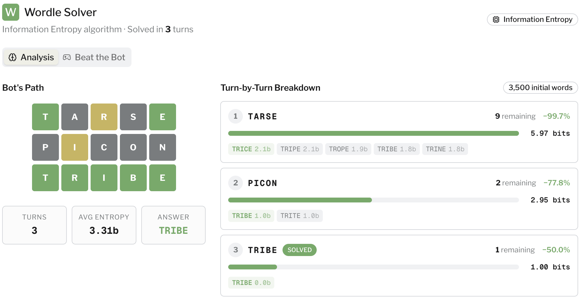

# NYT Game Solver

NYT Game Solver is a suite for using a mix of data science, NLP, and Information Theory methods to solve the daily games. It's originally inspired by me trying to beat all my friends in wordle and then going down a rabbit hole of finding the optimal starting words.

## Supported Games

* [Wordle](#wordle)
* [Connections](#connections)

## How it Works

### Wordle

The solver implements an algorithm from [this paper](https://orb.binghamton.edu/cgi/viewcontent.cgi?article=1146&context=nejcs) using shannon entropy to guess words with the most information gain.

Each guess includes 3 states possible across 5 different letters. Thus the possible entries are 243 possible states for every guess. $$  3^5 = 243 \text { color patterns}$$ 

 For a specific word, the probability $P[s]$ of getting a particular pattern $s$ is calculated by dividing the number of matching words in the pool by the total number of words left in the pool:

$$P[s]=\frac{\vert{}\{w\sim s\vert{}w\in Words\}\vert{}}{\vert{}\{w\vert{}w\in Words\}\vert{}}$$

The expected entropy $H(S)$ of a word (measured in bits) represents how much uncertainty is reduced on average if we were to guess it. Here we use the Shannon Entropy algorthm with the pattern probaility.

$$H(S)=-\sum_{s\in S}P[s]\log_{2}(P[s])$$


I've extended it to include beam search, maximizing the expected entropy gain across multiple guesses rather than just the next immediate guess.




### Connections

Coming soon....

## Installation

```bash
# Clone the repository
git clone https://github.com/cmiyai/NYT-GameSolver

# Navigate to the directory
cd NYT-GameSolver

# Install dependencies
pip install -r requirements.txt
```

## Usage

Run:
```bash
# Solve today's wordle or add a custom word for the solver
python wordle/solve_wordle.py
```
